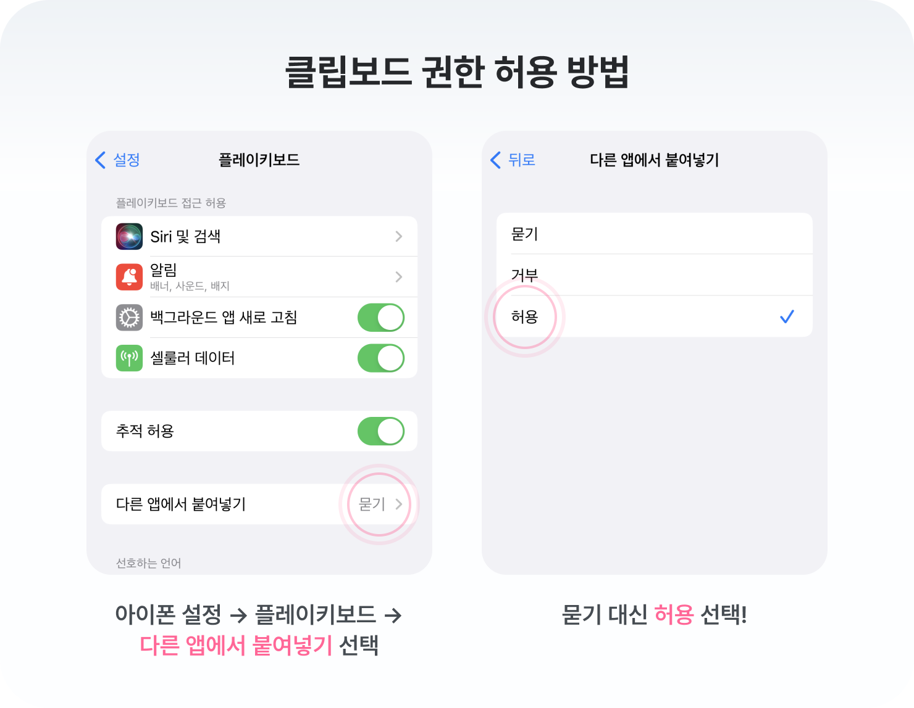
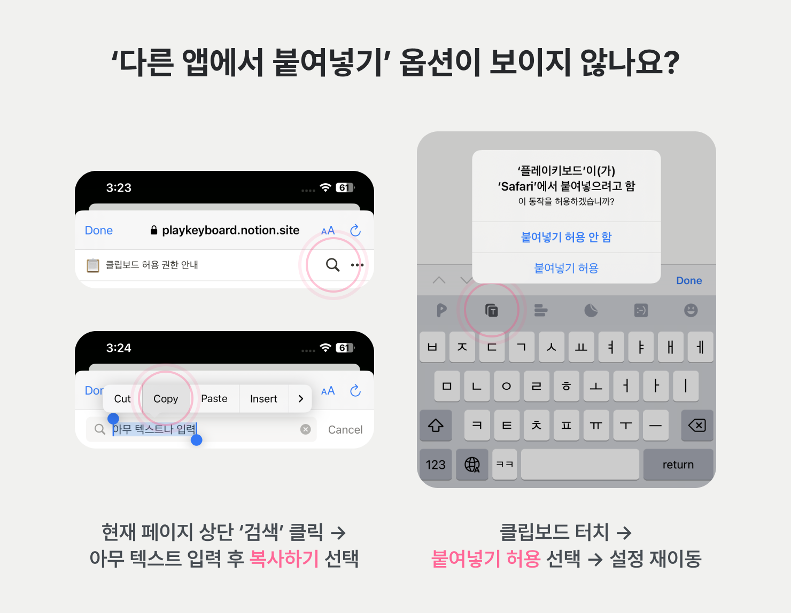
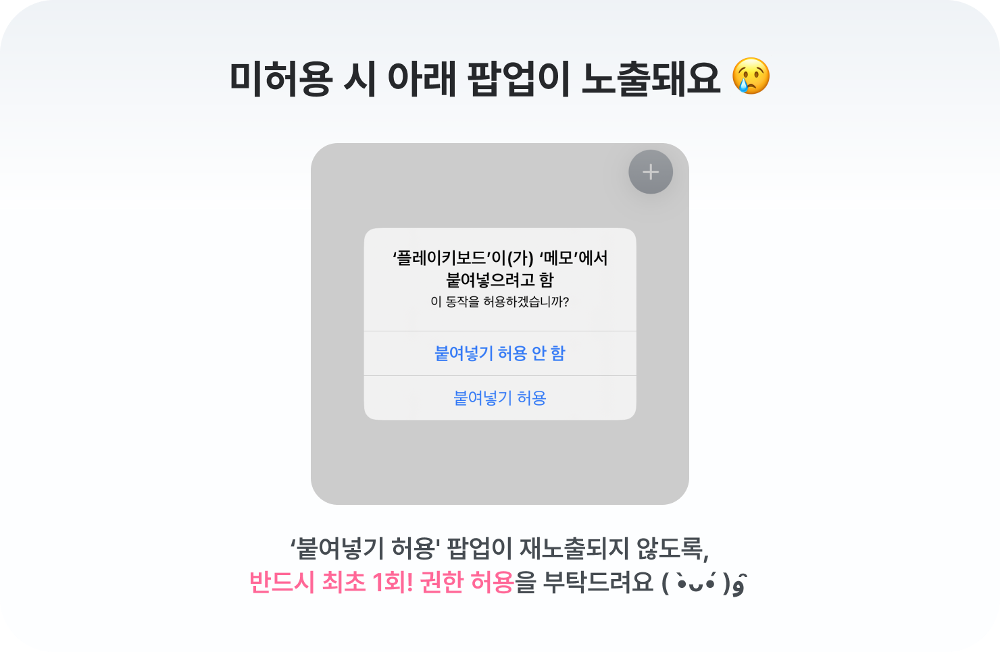

### 클립보드 허용 권한 안내

---

안녕하세요. 플레이키보드 팀입니다 :)

iOS 플레이키보드 유저분들의 편리한 입력을 위해 ‘클립보드’ 기능이 추가되었는데요. ✨

텍스트를 복사/붙여넣기할 수 있는 **‘클립보드’ 기능의 원활한 사용**을 위해,
시스템에서 **클립보드 허용 권한이 필요**합니다.

아래 안내를 따라 **최초 1회** 꼭 권한을 허용해주세요!

#### 클립보드 권한 허용 방법

① 아이폰 설정 → 플레이키보드 → **다른 앱에서 붙여넣기** 선택

② 묻기 → **허용** 선택, 끝!
  
> 📌 ‘다른 앱에서 붙여넣기’ 옵션이 보이지 않는다면, 아래 방법을 따라해주세요.
>    
>(플레이키보드에서 텍스트 복사/붙여넣기를 진행해야 옵션이 노출됩니다.)
>
>

  

#### 권한 허용을 하지 않으면 붙여넣기 팝업이 재노출됩니다.

`다른 앱에서 붙여넣기` 권한을 ‘허용’으로 선택 시, 붙여넣기 팝업이 노출되지 않습니다.

번거롭더라도 허용 권한을 설정하면 더욱 원활한 클립보드 사용이 가능하니 꼭 설정 부탁드립니다. 🙌

---

앞으로도 **세상에서 가장 빠르고, 편리하고, 재미있는 입력 경험**을 제공하기 위해 최선을 다하겠습니다.

감사합니다.

플키팀 드림

