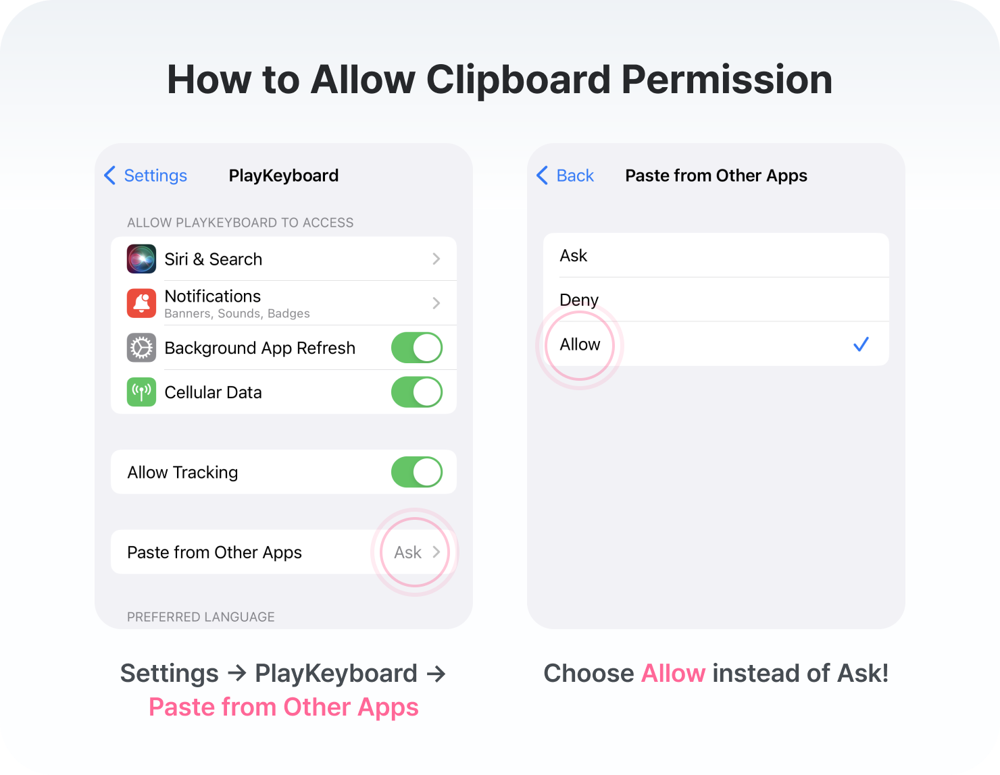
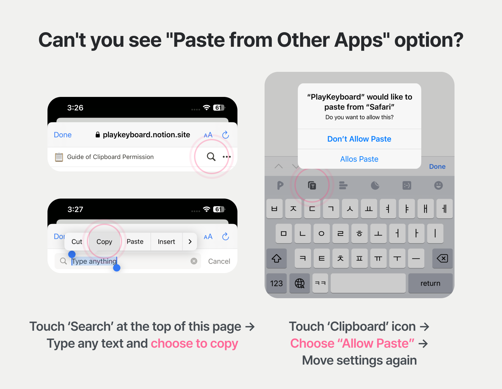
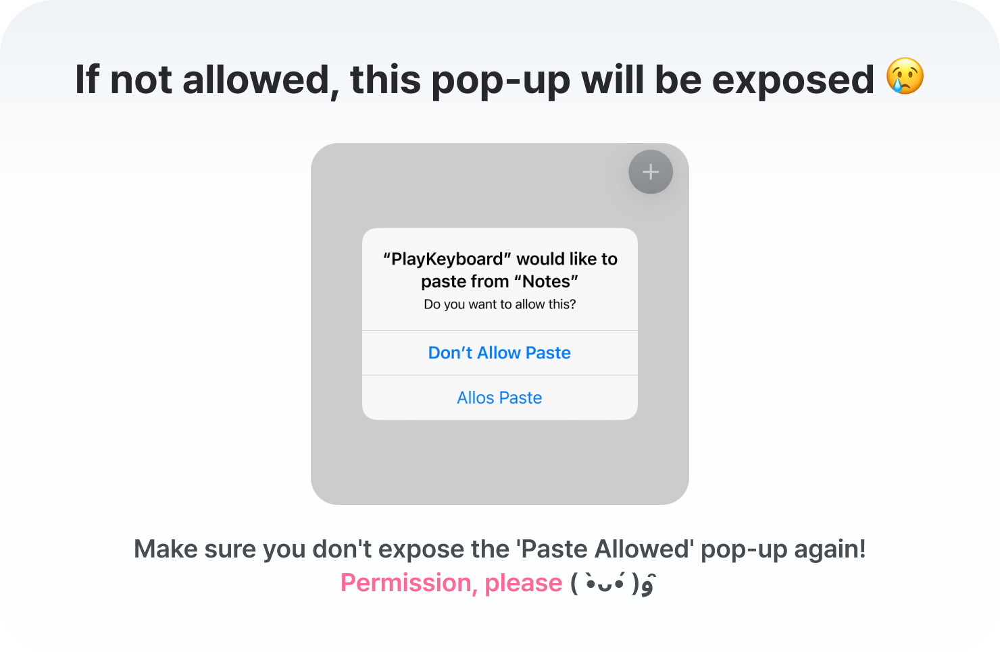

### Guide of Clipboard Permission

---

Hello, This is Team PlayKeyboard :)

'Clipboard' function has been updated for convenient input by iOS Play Keyboard users.✨

For smooth use of the 'Clipboard' feature that **allows you to copy/paste text**, the system requires **Clipboard Permission**.

Please follow the instructions below to allow permission **for the first time!**

#### How to Allow Clipboard Permission

① Settings → PlayKeyboard → **Paste from Other Apps**

② Choose **Allow** instead of Ask! Done :)
  
> 📌 If you don't see the “paste from another apps” option in the settings,
> Please follow the method below.
>    
>(The option will be exposed after copy/paste from PlayKeyboard.)
>
>

  

#### If you do not allow permissions, the paste pop-up will be re-exposed.

If `Paste from Other Apps` permission is selected as 'Allow', the paste pop-up will not be exposed.

Even if it's cumbersome, you can use the clipboard more smoothly if you set the permission, So please set it up 🙌

---

We will continue to do our best to **provide the fastest, most convenient and fun input experience** in the world.

Thank you.

PlayKeyboard

